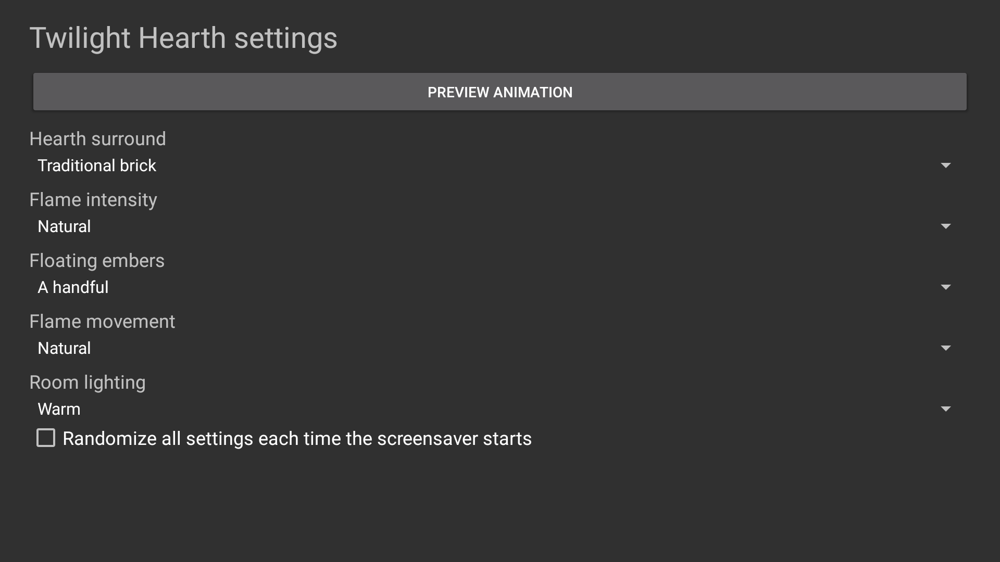

<p align="center">
    <picture>
        <source media="(prefers-color-scheme: dark)" srcset="art/banner-dark.svg">
        <source media="(prefers-color-scheme: light)" srcset="art/banner-light.svg">
        
    </picture>
</p>

<p align="center">A continuously animated fireplace screensaver for Fire TV, Android TV, and Google TV.</p>

<p align="center">
    <a href="https://github.com/jeremykenedy/twilight-hearth/releases"></a>
    <a href="https://github.com/jeremykenedy/twilight-hearth/releases"></a>
    <a href="https://github.com/jeremykenedy/twilight-hearth/actions/workflows/ci.yml"></a>
    <a href="https://github.com/jeremykenedy/twilight-hearth/actions/workflows/style.yml"></a>
    <a href="https://github.com/jeremykenedy/twilight-hearth/actions/workflows/docs.yml"></a>
    <a href="https://github.com/jeremykenedy/twilight-hearth/actions/workflows/security.yml"></a>
    <a href="LICENSE"></a>
    <a href="https://github.com/jeremykenedy"></a>
    <a href="https://github.com/jeremykenedy/twilight-hearth" title="Open the repository and click Star"></a>
    <a href="https://github.com/jeremykenedy/twilight-hearth/stargazers"></a>
    <a href="https://github.com/sponsors/jeremykenedy"></a>
</p>

<p align="center">Show some love by starring this repository on GitHub.</p>

## Table of contents

- [Privacy](#privacy)
- [Features](#features)
- [Requirements](#requirements)
- [Installation](#installation)
- [Configuration](#configuration)
- [Screenshots](#screenshots)
- [Building and testing](#building-and-testing)
- [Documentation](#documentation)
- [Release notes](#release-notes)
- [Project policies](#project-policies)
- [License](#license)

## Privacy

The app requests no network permission and makes no network requests. It includes no ads, analytics, telemetry, crash reporting, or tracking. The standalone installer contacts GitHub only when you ask it to download a release APK and checksum. It sends no device or usage data.

## Features

- Continuously animated flames with shifting tongues, glowing logs, rising embers, and room light that pulses with the fire.
- Three original room surrounds: traditional brick, natural stone, and modern dark.
- Independent choices for flame intensity, ember count, movement speed, and room lighting.
- Per-setting random values and an option to randomize all settings whenever the screensaver starts.
- Remote-friendly settings and an app-owned provider schema for host applications.
- A native Android DreamService with an in-app animation preview.

## Requirements

- Android 6.0 (API 23) or later.
- A device that exposes Android's DreamService screensaver settings.
- Android SDK platform 36 and build-tools 36.0.0 to build from source.

Native support has been tested on the Android TV emulator listed in [device verification](docs/VERIFICATION.md). Fire TV and Google TV hardware have not been tested for this release.

## Installation

Connect the TV or emulator with ADB and run `python3 install.py --serial DEVICE`. The installer downloads the latest signed release, verifies its published SHA-256 checksum, and installs or updates the app. Select Twilight Hearth in the device's screensaver settings afterward. The installer does not change system settings.

To remove the app, run `python3 install.py --serial DEVICE --uninstall --yes --force`. See [installation](docs/INSTALLATION.md) for local APK installation and safety details.

## Configuration

Open Twilight Hearth from the TV launcher and use the remote to adjust settings. Changes take effect the next time the screensaver starts. See [configuration](docs/CONFIGURATION.md) for supported values and the settings-provider interface.

## Screenshots

<p align="center">
    
</p>

<p align="center">
    
</p>

This 1920x1080 screenshot was captured from the running app on Android TV emulator 5570 after the scene settled. Its configuration and capture method are recorded in [device verification](docs/VERIFICATION.md).

## Building and testing

```bash
bash build.sh
bash test.sh
bash scripts/test-python-coverage.sh
bash scripts/test-coverage.sh
```

The app uses the Android SDK and JDK without third-party runtime dependencies. See [building](docs/BUILDING.md), [testing](docs/TESTING.md), and [architecture](docs/ARCHITECTURE.md).

## Documentation

- [Installation, update, and removal](docs/INSTALLATION.md)
- [Configuration and host integration](docs/CONFIGURATION.md)
- [Building from source](docs/BUILDING.md)
- [Architecture](docs/ARCHITECTURE.md)
- [Testing and coverage](docs/TESTING.md)
- [Device verification](docs/VERIFICATION.md)
- [CI](docs/CI.md)
- [Troubleshooting](docs/TROUBLESHOOTING.md)
- [Release process](docs/RELEASING.md)

## Project policies

- [Contributing](CONTRIBUTING.md)
- [Security reporting](SECURITY.md)

## Release notes

- [Version 1.0.0](docs/releases/v1.0.0.md)

## License

Twilight Hearth is licensed under the [Apache License, Version 2.0](LICENSE). See [NOTICE](NOTICE) for project notices.
